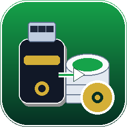

<p align="center">
  
</p>

<h1 align="center">KeyTwin</h1>

<p align="center">
  Копия ЭЦП с токена в реестр за 3 клика. Без консоли.
  <br>
  <a href="https://github.com/mrSaT13/KeyTwin/releases"><b>⬇ Скачать KeyTwin.exe</b></a>
</p>

<p align="center">
  
  
  
  
  
</p>

## ✨ Что это

KeyTwin копирует контейнер закрытого ключа с USB-токена
(Рутокен, JaCarta, eToken) в реестр Windows и ставит сертификат в «Личные».

Внутри — только штатный `csptest.exe` из КриптоПро CSP 5.
Никакого взлома защиты: неэкспортируемые ключи скопировать нельзя,
программа честно покажет ошибку.

- 🔍 находит контейнеры сама (с дедупом)
- 🔑 PIN в лог **не пишет никогда** — только `***`
- 🔔 сворачивается в трей, уведомляет о готовности
- 🌍 RU / EN

## 🚀 Быстрый старт

1. Скачай [**KeyTwin.exe**](https://github.com/mrSaT13/KeyTwin/releases) и запусти
2. Вставь токен → **Обновить список** → выбери контейнер
3. Имя копии (напр. `ivanov-copy`) → PIN токена → пароль копии → **Скопировать**
4. Дождись `0x00000000` → проверь копию в КриптоПро → Сервис → Сертификаты

<details>
<summary>Запуск из исходников</summary>

```bat
git clone https://github.com/mrSaT13/KeyTwin.git
cd KeyTwin
pip install -r requirements.txt
python copy_token_gui.py
```

Сборка exe: `pyinstaller TokenCopy.spec` → `dist\KeyTwin.exe`

</details>

## 🖼 Скриншоты

| Окно | Трей |
|---|---|
| `docs/screenshot-main.png` | `docs/screenshot-tray.png` |

## ❓ Не работает?

- **Список пуст** — токен вставлен? Драйверы стоят? В КриптоПро → Оборудование → Считыватели есть носитель? Попробуй запустить с/без администратора (контейнеры разные)
- **`csptest.exe НЕ НАЙДЕН`** — установи КриптоПро CSP 5
- **`0x8009000B`** — ключ неэкспортируемый (ФНС после 2022). Так и должно быть
- **Неверный PIN** — это PIN токена, не пароль Windows. Стандартные: Рутокен `12345678`, JaCarta `11111111`, eToken `1234567890`

Не помогло — заведи [Issue](https://github.com/mrSaT13/KeyTwin/issues).

## ⚠️ Важно

- Копируй только свои ключи
- Копия в реестре умирает вместе с Windows — храни токен
- После копирования ключ всегда подключен — поставь пароль на ПК

## 🤝 Contributing

PR и Issues приветствуются. Перед коммитом прогони `python -m py_compile copy_token_gui.py`.

## 📄 Лицензия

[MIT](LICENSE) © 2026 [mrSaT13](https://github.com/mrSaT13).
КриптоПро CSP, Рутокен, JaCarta — товарные знаки их владельцев, проект с ними не аффилирован.
